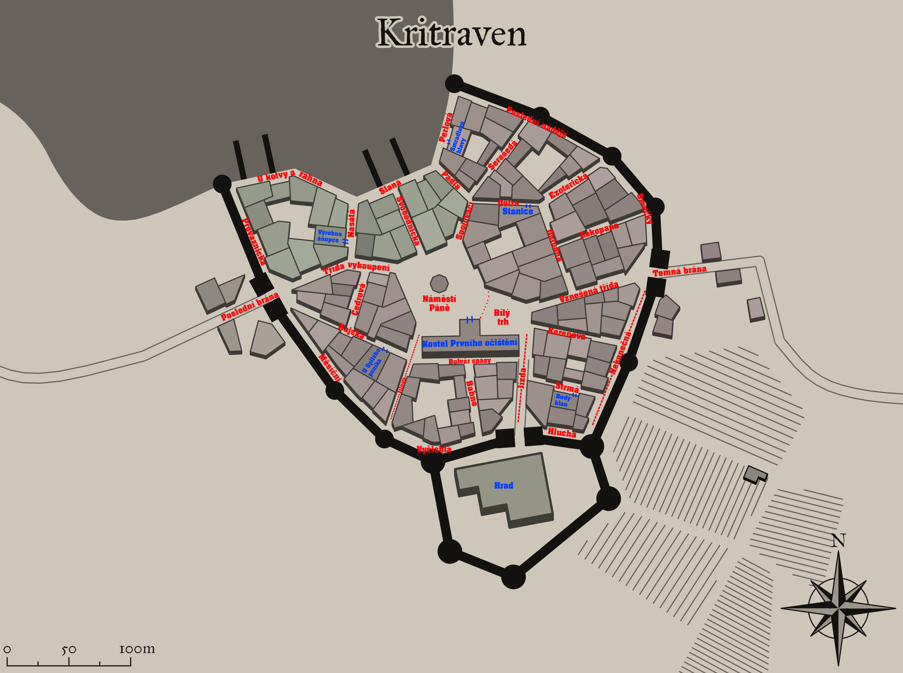

# DnD-Telegram-Bot

## Jak hru spustit?
Je to velice jednoduché!
1. Jelikož se jedná o `bota` na Telegramu, tak si budete muset založit účet na Telegramu.
2. Najděte si na Telegramu uživatele `@dnd_zapocet_bot` (https://t.me/dnd_zapocet_bot)
3. Napište první zprávu ve tvaru `/start`
4. Užijte si to!

## Jak sám spustit bota?
1. Opět na to budete potřebovat Telegram.
2. Napište uživateli `@BotFather` (https://t.me/BotFather)
3. Nechte si vytvořit `bota`.
4. Zkopírujte si jeho `HTTP API`.
5. Najděte ve složce `data` soubor `token.txt` a vložte do něj token.
6. Dále budete potřebovat Python, pokud ho nemáte, stáhněte zde: https://www.python.org/downloads/
7. Otevřete příkazovou řádku a napište:
   `pip install python-telegram-bot --upgrade`
8. Pokud vám příkazová řádka hlásí, že nemáte pip, naistaujte si ho, dle postupu zde: https://pypi.org/project/pip/
   - Znovu napište `pip install python-telegram-bot --upgrade`
9. Stáhněte si kód z githubu
10. Dekomprimujte složku
11. V příkazové řádce si otevřete dekomprimovanou složku `DnD-Telegram-Bot-master`, ve které jsou přímo všechny další složky jako `data` a `lib`.
12. Zadejte `python lib\main.py`, čímž spustíte program.
13. Váš bot teď běží a můžete se řídit postupem v `Jak hru spustit?`
14. Bot bude reagovat a odpovídat na vaše zprávy, dokud budete mít zaplý program. Pokud ho ukončíte, přestane vám v chatu odpovídat.

***

## Vlastní dokumentace

### Anotace
Problémem, který řeší můj program, je nuda. Jedná se totiž o hru, a to konkrétně o hru výpravnou inspirovanou textovými adventurami a Dračím doupětem. Uživatel, tudíž hráč, se ocitne ve městě zvaném Kritraven a musí se mu podařit schovat či uprchnout dříve, než ho dopadne hlídka. Hra je rozdělena na kola a v každém z nich musí hráč pečlivě volit svá rozhodnutí a uvážit své kroky. Hráč samozřejmě není ve městě sám, ba naopak může potkat několik NPC, se kterými může interagovat, a tak ovlivnit výsledek hry.

### Přesné zadání
Cílem programu je vytvořit hru, kterou bude zprostředkovávat bot na Telegramu. Hra je inspirovaná jak Dračím doupětem, tak textovými adventurami. Hlavní myšlenkou je, že je zde minimum naskriptovaných věcí. Hráč sám se ocitne ve městě, kde je několik dalších postav, kterým sice někdo zadal, co mají dělat. Ale co když jim v tom někdo zabrání? V tom případě budou muset podniknout něco jiného? Co když postava uvidí, jak někdo útočí na jeho kamaráda. No pomůžeme, ale co když při tom náhodou zemře, její vlastní povinnosti pak už nikdo nesplní.


## Statická data
### Mapa
Mapa Kritravenu, viz obrázek, sestává ze 40 navštívitelných míst. Jedná se tedy o graf, jehož vrcholy jsou ulice a hrana mezi ulicemi (či ulicí a místem) existuje právě tehdy, když se obě ulice protínají či sbíhají.
Seznam těchto míst se načítá ze souboru streets.csv. Pro každé jedinečné ID ulice je určeno jméno místa a též seznam indexů, jež jsou spojené s hranou s daným místem.



Veškerá data o mapě a všech místech na ní jsou uloženy v souboru `streets.csv`.
Každé místo v souboru má momentálně své jedinečné ID, jméno v češtině, popis v češtině, seznam ID míst spojených s tímto místem, možnost speciálních akcí pro toto místo a omezení přístupu 

#### Reprezentace:
+ ID
    + `integer` - např. `3`
+ name_cz
    + `string` - např. `Perlová`
+ connected_ID
    + `seznam integerů oddělených ";"` - např. `2;8;10;37`
+ description_cz
    + `string` - např. `Perlová ulice je navzdory svému názvu známá...`
+ possibilities
    + `dva stringy odděleny ":"` - např. `shop:food`
    + první je vždy typ (`shop` je zatím jediná taková implementace)
    + druhé je upřesnění (typy pro `shop` se odvozují z parametru `type` v tříde `Items`)
+ access
    + `string` - např. `free`
    + momentálně neimplementovaná vlastnost

#### Zpracování:
O zpracovávání těchto dat se stará knihovna `map.py`, která definuje třídu `Street`, do které se ukládají veškerá data zmíněná výše. Navíc je zde třída `Map`, která v sobě ukládá všechny objekty `Street` a poskytuje metody pro práci s nimi. Mezi ně patří metoda `BFS`, jejímž jediným argumentem je výchozí místo. Metoda provádí průchod do šířky grafem mapy a vrací seznam ulic a seznam vzdáleností ulic na stejném indexu od výchozí ulice. Druhou důležitou metodou je pak `find_shortest_path`, která bere jako argumenty tyto 2 seznamy a k tomu ještě cílové místo a vrací jednu z nejkratších cest z výchozího do cílového místa.

Za zmínku též stojí funkce `read_map_from_file`, která se stará o načtení dat ze souboru a jejich uložení do objektu třídy `Map`

Zbytek funkcí a metod je i s komentáři k naleznutí v `lib/map.py`

***

### Postavy
Ve hře je momentálně 36 různých postav. Každá z nich se pohybuje a koná akce samostatně a když je to potřeba, řídí se úkoly (více viz dále)
Seznam všech postav a údaje o nich nalezneme v souboru `characters.csv`. Každá z nich má svoje jedinečné ID, jméno v češtině, ID frakce, ke které náleží, ID ulice, kde se při začátku hry ocitnou, ID ulice, kam se uchýlí, když nemají nic na práci, jejich rychlost, síla a počet peněz.

#### Reprezentace
+ ID
    +  `integer` - např. `1`
+ name_cz
    +  `string` - např. `Strážník Poleno`
+ fraction_ID
    +  `integer` - např. `0` 
+ spawn_street_ID 
    +  `integer` - např. `35` 
+ end_street_ID
    +  `integer` - např. `14` 
+ speed
    +  `integer` - např. `3` 
+ strength
    +  `integer` - např. `1` 
+ coins
    +  `integer`- např. `40`
    +  momentálně neiplementovaná vlastnost


#### Zpracování
O zpracování těchto dat se stará knihovna `character.py`. Ta definuje třídu `NPC` do jejíchž objektů se ukládají všechny data uvedená v reprezentaci. Dále je zde třída `Society`, která ukládá všechny objekty typu `NPC` a definuje metody pro práce s nimi.
Nachází se zde též funkce `read_people_from_file`, jež se stará o načtení všech postav, jejich reprezentaci jako `NPC` a jejich uložení do objektu třídy `Society`

***

### Frakce
Jak již bylo naznačeno v reprezentaci postav, tak jsou v této hře definovány i takzvané frakce. Seznam všech těchto frakcí je uložen v souboru `fractions.csv`, kde je pro každou z nich definováno jedinečné ID, jméno v češtině, ID místa jejich residence a vztahy s ostatními frakcemi.

#### Reprezentace
+ ID
    + integer - např. `0`
+ name_cz
    + string - např. `Hlídka`
+ residence_ID
    + integer - např. `35`
    + momentálně neimplementovaná vlastnost
    + nikam nepatřící postavy nemají residenci `-1`
+ relations
    + řetězec integerů oddělených středníkem - např. `3;1;1;0;2;3;-1`
    + význam hodnoty vztahů
      + `3`  = nasadíme za vás svůj život
      + `2`  = nevadíme si
      + `1`  = klidně tě udám
      + `0`  = zabiju tě tady a teď
      + `-1` = nedefinováno (když nemá smysl určovat)

#### Zpracování
O zpracování těchto dat se stará též knihovna `character.py`, která definuje třídu `Fraction`, do které se ukládají všechny vlastnosti vypsané výše. Jako vždy je definována třída `PoliticalMap`, která v sobě ukládá všechny frakce a definuje metody pro práce s nimi.
Pro načtení a zpracování všech frakcí je zde `read_fractions_from_file`, která zkonstruuje objekt třídy `PoliticalMap` se všemi frakcemi ve formě `Fraction`.

***

### Úkoly
Úkoly, ruka boží, která řídí chování všech postav v této hře. Pod pojmem úkol se zde rozumí spíše úkolová linie. Ta se dělí na části, které se nazývají fáze. Linie zde však není definována jako posloupnost fázi, ale jako binární strom. Jeden syn vždy reprezentuje úspěšné splnění fáze a druhý neúspěšné. Takto uložené linie jsou k nalezení v souboru `quest-lines.txt` v následujícím formátu:
1. Na prvním řádku je počet linií zde uložených
2. Dále jsou data k jedné linii uloženy vždy ve dvou řádcích
   1. `ID linie + "=" + jméno v češtině` 
         - Např. `5=Lov na kočku`
   2. Strom fází reprezentován jako string
         - Více informací za chvíli

#### Reprezentace - Fáze úkolů
Každá fáze je reprezentována řetězcem jako posloupnost několika modifikátorů, jež jsou od sebe odděleny znakem rovná se. Např: `0=char12=36=0=37=none=40%-1`

##### Kódové označení fáze
Hned první modifikátor měl původně jasný význam, avšak s průběhem vývoje se ukázal být nepotřebný a nahradila ho kombinace jiných modifikátorů.
První modifikátor však našel jiné využití a to označení speciálních fází. Momentálně je definována pouze jedna speciální fáze, a to terminální fáze. Pokud se postavě podaří splnit takovou tu fázi, tak končí hra a hráč prohrává. Její kód je symbolicky `666`. 

##### Kdo
Zde můžou nastat 2 varianty:
+ Fáze je určena pro určitou postavu
    + `Modifikátor := “char“ + ID všech postav oddělené středníky`
+ Fáze je pro kohokoliv z určité frakce
    + `Modifikátor := “frac“ + ID určené frakce`
+ Momentálně nedotažená funkce. Tento způsob sice funguje, ale když mise probíhá a má ji zadaná určitá náhodná postava, tak může být v dalším kole přidělena jiné postavě, musí se tedy implementovat jakési sledování, že někdo danou fázi plní. Podobně se zadáním více určitých postav.

##### Odkud
+ Pokud je určené místo, kde musí fáze započít: 
    + `Modifikátor := ID místa`
+ Pokud místo určeno není: 
    + `Modifikátor := -1`

##### Předmět
Pro určité fáze může být potřeba, aby u sebe postava, která jej vykonává, měla nějaký předmět. Ten jí bude do inventáře přidělen až se dostane na místo, kde jeho fáze začíná a když fázi splní, tak bude zase odebrán.
+ Pokud by mělo nastat, že stejný předmět bude potřeba pro více fází za sebou, tak stejně bude po každé fázi odebrán a poté přidán zpět.
+ Pokud by měla postava o přidělený předmět během mise přijít, tak je to bráno jako neúspěch.
    + Tato funkce bohužel také ještě není implementována.
+ `Modifikátor := ID předmětu`
+ `Modifikátor := -1` (pokud není určen předmět)

##### Kam
+ Pokud je přesně definováno místo, pak: 
    + `Modifikátor := ID cílového místa`
+ Může však nastat situace, že výsledné místo není přesně známo anebo se průběžně mění. V tom případě bude:
    + `Modifikátor := “?“` a výsledné místo se určí dle typu fáze jiným modifikátorem.

##### Jdi za
+ Pokud není pevně určeno výsledné ID místa, je možné, že je zapotřebí, aby postava došla za nějakou jinou. V tom případě: 
    + `Modifikátor := ID hledané postavy + “;“ + parametr akce`
+ Pokud bude výsledné místo určeno jinak: 
    + `Modifikátor := “none“`
+ Když postava zastihne jinou, tak existuje několik možností, co bude dělat dál.
    + Zab – `parametr akce := “kill“`
    + Omrač – `parametr akce := “stun“`
    + Okraď – `parametr akce := “rob“`
    + Podstrč – `parametr akce := "plant"` 
    + Nic – `parametr akce := “none“`
    + Mluv – `parametr akce := „talk“`
        + Zatím bohužel není implementována
    + Přiveď – `parametr akce := “bring“`
        + Zatím bohužel též není implementována
+ Momentálně nedotažená mechanika. Jak postava ví, kde se nachází někdo jiný? Pokud hledaná postava někam půjde, tak pro ostatní bude velmi těžké ji zastihnout.

##### Odměna
Pokud postava úspěšně dokončí fázi, tak za to dostane odměnu. Forma může být formou peněz, předmětu či obojího najednou
Ta je definována:
+ `Modifikátor := počet peněz + "%" +  ID předmětu`
    + Pokud by neměly být za fázi předány žádné peníze, tak zde bude `počet peněz = 0`
    + Pokud by neměl být předán žádný předmět, tak bude `ID předmětu = -1`

#### Reprezentace stromu fází
Strom je reprezentován pomocí závorek, které vždy ohraničují syny. První syn je větev, který následuje po úspěšném splnění předchozí fáze, druhý reprezentuje neúspěch.
Pokud již  nemá být žádný další syn, neboli jeho hodnota je `None`, tak to bude zaznačeno prázdnými závorkami `()`.
Např: `Fáze(Úspěch()())(Neúspěch()())`

#### Zpracování úkolů a fází
O načtení a zpracování úkolových dat se stará knihovna `quest.py`. Ta definuje tři zásadní třídy `ModifiedQuestPhase`, `Node` a `QuestLineTrees`.
- Instance třídy `ModifiedQuestPhase` ve svých atributech ukládá veškeré údaje o fázi, jak byly popsány výše. Je na ni též reprezentována funkce `__str__`, která ji převede zpět do textové reprezentace.
- Třída `Node` je poté základní páteří úkolových stromů. Každý `Node` má svou `value`, ve které je uložen seznam řetězcových vyjádření fází.
    - Pozn. `value` je definována jako seznam, protože původní idea byla, že by fáze mohla spustit více dalších podfází, avšak to bude vyžadovat komplexnější řešení úspěchu či selhání této skupiny a její vyhodnocení pro další syny. Proto, i když se jedná o seznam, tak program vždy bere pouze první fázi a ostatní prozatím ignoruje.
- Poslední je `QuestLineTrees`, které do slovníků ukládá indexy, jména a kořeny všech úkolových stromů.
Důležité funkce této knivny jsou pak `str_to_mqp` a `mqp_to_str`, které převádějí `string` na `ModifiedQuestPhase`.
Za povšimnutí též stojí funkce `create_tree_from_str`, která rekurzivním procházením tvoří ze `stringu` strom složený z `Nodes`. Funkce pracuje tak, že řetězec vždy rozdělí dle závorek na hodnotu svojí a další syny. Podívá se na syny a pokud nějaký z nich není `None`, tak se funkce zavolá rekurzivně na něj. To pokračuje tak dlouho, dokud nejsou oba synové `None`. Poté se `Nodes` vrací až se vytvoří celý strom.
Funkce `print_tree` je poté funkcí inverzní ke `create_tree_from_str` a tvoří `string` ze stromu. Jediný rozdíl je, že výsledek pouze vytiskne, funkce tak slouží hlavně na ladění programu.
Samozřejmě zde máme i funkci `read_quest_lines_from_file`, jež načte všechny úkolové stromy a uloží je do instance třídy `QuestLineTrees`


## Dynamicky generovaná data
Jelikož se jedná o hru, tak chceme, abychom se jak my, tak ostatní postavy, mohli nějakým způsobem pohybovat po mapě a interagovat s ostatními. Abychom toho ale docílili, tak musíme vědět, kdo v každou chvíli je. Z tohoto důvodu existuje soubor `game_saves.csv`, ve kterém je uložen aktuální stav jak hráče, tak všech postav, a i progres úkolových linií.

Jelikož hru zprostředkovává bot na telegramu, tak by mohla nastat situace, kdy by hru chtělo hrát více uživatelů najednou. Pro každého z nich musí tedy existovat právě jedno uložení postupu. Který postup patří jakému uživateli se určí dle konkrétního ID chatu, které lze získat přes bota.
Data k jedné hře tedy budou vždy uloženy ve dvou řádcích. Na prvním bude ID chatu a na druhém řetězec znaků obsahující veškeré potřebné informace, viz dále, jehož segmenty od sebe budou odděleny znakem `"_"`.

O programové zpracování všech těchto dat se stará knihovna `save.py` jež využívá i některé další knihovny (viz dále).
Nutno je zmínit funkci `read_current_save`, která na základě ID chatu vrátí celý `string` se všemi uloženými daty.

### Stav hráče

#### Reprezentace
Stav hráče je definován řetězcem znaků složených z více částí, jež jsou odděleny `“,“`.
+ Místo, kde se hráč nachází `:= “place:“ + ID místa`
+ Počet peněz, jenž má `:= “coins:“ + počet peněz`
+ Předměty `:= “items:“ + ID předmětů oddělené středníky` 
    + Např.: `“items:1;3“`
+ Síla := `“str:“ + hodnota síly hráče`
+ Rychlost `:= “speed:“ + hodnota rychlosti`
+ Vztah ke frakcím `:= “relations:“ + hodnoty`
    + Definovány stejně jako ve Frakcích.
    + Pro každou frakci oddělené `";"`
    + Hodnoty jsou ve stejném pořadí jako indexy frakcí.
+ Frakce hráče `:= "fraction:" + ID frakce`
+ Stav hráče `:= "state:" + určitý stav`
  + Stavy jsou následující:
    + `alive` - hráč může bez problému hrát
    + `stun` - hráč na několik kol po dobu tohoto efektu nehraje
    + `dead` - hráč prohrál
+ Trvání efektů `:= "duration:" + typ stavu + "/" + doba trvání`
    + Stavy mohou být následovné:
        + `stun`
        + `"str" + hodnota bonusové síly`
        + `"speed" + hodnota bonusové síly`
+ Zbraně jež má hráč vybavené `:= "weapons:" + ID 1. zbraně + ";" + ID 2. zbraně`
+ Úkol zadaný postavě `:= "quests:" + stringové vyjádření ModifiedQuestPhase objektů oddělené "/"`
+ Progres úkolů `:= fáze úkolů oddělené "/"`
+ Při spuštění nové hry se nastaví výchozí nastavení následovně:
    + `"place:0,coins:25,items:7;8;9,str:2,speed:2,relations:2;2;2;2;2;2;2,fraction:4,state:alive,duration:,weapons:,quests:0=char12=37=1=32=none=40%-1/7=char29=-1=-1=?=31;stun=14%14,progress:tostart/inprogress"`

#### Zpracování dat
Na uložení všech těchto dat je v knihovně `player.py` definována třída `Player`. Pro tuto třídu je zde poté definováno plno metod (jako například pohyb, používání předmětů), díky kterým může hráč hru hrát. Než je tady všechny vypisovat, tak doporučím podívat se do `player.py`.
V knihovně `save.py` jsou poté funkce, jež zpracují vstupní save data a vytvoří z nich instanci objektu `Player`. Na tuto specifickou akci je zde funkce `get_current_player`, která rozdělí řetězec dle `","` a tyto části pak na `key` a `val` dle `:` a už je jen přiřadí správným atributům. 
Opačnou funkci plní funkce `player_save_generator`, která objekt `Player` přetvoří na `string`.

### Stavy úkolových linií

#### Reprezentace
Stavy jednotlivých linií v řetězci jsou opět rozděleny čárkami `“,“` . Stavy linií jsou uloženy postupně dle rostoucích indexů. 

Jelikož je každý linie úkolů implementována jako binární strom, kdy jeden syn značí úspěch a druhý neúspěch, tak můžeme cestu do konkrétního uzlu stromu definovat jako posloupnost písmen `"F"` a `"S"`, kdy `"F"` znamená, že v daném bodě nastal neúspěch a máme se posunout na takového syna. Naopak `"S"` pak znamená úspěšné splnění mise. 

Pokud je řetězec prázdný, znamená to, že je aktivní stále první fáze, tedy kořen stromu. 

#### Zpracování dat
Pro operování s daty o průběhu úkolů opět použijeme knihovnu `save.py`. Je zde pro to několik funkcí, ale za zmínku stojí hlavně `get_current_quests`, která dle řetězců progresu složených z `"F"` a `"S"` prochází úkolové stromy, a nakonec vrátí aktuální fázi, jež probíhá. Další funkce je `assign_quests`, která prochází aktuální fáze získané předchozí fází a přiřazuje je postavám, které je pak budou vykonávat.


### Stavy postav

#### Reprezentace
Stav každé z postav je v řetězci oddělen `“+“` a jednotlivé části každého stavu `“,“`. Postavy jsou též řazeny dle indexu.

Totožně jako u stavu hráče jsou definovány následující:
+ Místo
+ Počet peněz
+ Předměty
    + Změna oproti postavě je ta, že předměty, jež má postava u sebe jsou automaticky brané jako vybavené
+ Síla
+ Rychlost
+ Stav

Pro postavy jsou však definovány i vlastnosti, které hráč nemá:
+ Úkolová linie `:= “line:“ + ID úkolové linie, kterou plní`
+ Fáze `:= “phase:“ + určená modifikovaná fáze, kterou právě plní`
    + Uložená ve stejném formátu, jako bylo definováno v Liniích úkolů pro fáze definované modifikátory.
+ Stav plnění fáze `:= “stage:“ + konkrétní stav` 
+ Rozlišujeme 3 různé stavy:
    + Fáze ještě nezačala = postava teprve musí dojít do výchozího místa `“tostart“`
    + Fáze právě probíhá = postava se musí dostavit na určené místo `“inprogress“`
    + Fáze právě skončila = postava se dostavila na určené místo a provede zadanou akci `“ended“`

+ Pokud postava žádný úkol neplní, tak bude za všemi klíčovými slovy a dvojtečkou `-1`
  + Úkolová část postavy pak bude vypadat následovně: `“line:-1,phase:-1,stage:-1“`

#### Zpracování dat
Je pravda, že i zde se využije pár funkcí ze `save.py`, ale hlavní podpora pro práci s těmito daty se nachází v knihovně `character_handler.py`. Zde jsou definovány dvě třídy. První z nich je `ModifiedNPC`, do kterého se každé kolo ukládají všechny stavová data postavy načtené ze save file. Pro přístup ke všem `ModifiedNPC` je zde třída `ModifiedPeople`, která i definuje metody pro přijemnější práci s nimi.
Mimo třídy je nutno zmínit funkci `get_current_characters`, která se stará o načtení aktuálních dat všech postav. Pak se zde nachází spousta dalších funkcí na práci s postavami, jako například jejich pohyb, souboj a podobně. Vše je podrobně okomentováno v samotném `character_handler.py`.

## Průběh hry a herní rozhraní

O řízení hry i herního rozhraní se stará soubor `main.py`. Už jen kvůli množství různých funkcí není v mých silách všechny je zde vypsat, zmíním tak jen ty nejdůležitější, jelikož zbytek je stejně okomontován přímo v kódu.

### Průběh hry

Stejně jako `Dračí Doupě`, tato hra funguje na kola. Začíná hráč. Každé kolo je ukončeno hráčovým pohybem na jiné místo. Avšak během svého kola může udělat kolik akcí jen chce. Může si měnit předměty, nakupovat, pokud zrocna stojí u obchodu, bavit se s postavami, pokud tam jsou, nebo s nimi bojovat. Avšak, když se hráč pohne, tak jsou na řadě postavy.
To, co se poté děje, a jak se to děje, řídí hlavně funkce `rotation`. Ta si nejdříve načte všechna aktuální data o postavách a průběhu úkolů. Zkontroluje, zda nějaká postava nesplnila nějaký úkol, aktualizuje postupy a přiřadí nové fáze ostatním.


```python
async def rotation(chat_ID: int, context: ContextTypes.DEFAULT_TYPE, update: Update) -> None:
    """Function take care of handling movement of NPC, making them follow missions etc.
    It also updates questlines progresses and assign phases to NPCs based on it"""

    # Getting current data that are potentially changed by player inputs from last time
    current_characters: ModifiedPeople = context.user_data["current_people"]
    current_quests_str: str = context.user_data["current_quests_str"]
    player: Player = context.user_data["player"]

    # Updating quest lines for characters. If game ending line has finished, the game ends
    current_characters, lines_to_update, game_ended, game_ending_str = save.update_phases(
        current_characters)
    if game_ended:
        return await end_game(update, context, game_ending_str)

    new_quests_str = save.update_quests(current_quests_str, lines_to_update)

    current_quests_save = save.get_current_quests(new_quests_str)

    current_characters = save.assign_quests(
        current_characters, current_quests_save)

    # Make characters follow their quests and then parse to string so the progress can be saved
    current_characters_str = save.move_characters(current_characters).to_str()

    # Updates progress and gets list of quests completable in this place.
    quests_to_finish = player.update_quest_progresses(current_characters)
    context.user_data["additional_actions"] = quests_to_finish
    if len(quests_to_finish) > 0:
        await update.message.reply_text("\u2757 Máš zde úkol \u2757")

    new_player_save = save.player_save_generator(player)

    context.user_data["current_quests_str"] = new_quests_str

    combined_save = f"{new_player_save}_{new_quests_str}_{current_characters_str}"

    save.rewrite_save_file(chat_ID, combined_save)

    # When player is not capable of moving proceed to next round and move characters again
    # TODO change from recursion to loop
    if player.state == "stun" and player.duration["stun"] >= 1:
        await rotation(chat_ID, context, update)
```

Ve zdrojovém kódu si můžete povšimnout, že využívá metod a funkcí z ostatních knihoven, jež jsem již zmiňoval dříve.
Když doběhne funkce `rotation`, tak je opět na řadě hráč.


### Herní rozhraní 

Zaměřili jsme se na vše, co se děje v pozadí a teď se pojďme zaměřit na to, jak může hráč ovládat svou postavu.
Nejprve je nutno zmínit, že mimo všechny mou napsané knihovny, jež jsem zde zmiňoval, hra též používá externí knihovnu `python-telegram-bot`.
Vše začíná funkcí `main` z `main.py`
První se pomocí tokenu program spojí s botem na telegramu, a tak může komunikovat přes Telegram místo konzole.
Dalším krokem je vytvoření objektu `ConversationHadler`. Díky tomuto je vytvořena komunikace mezi hráčem a programem.
Ve výsledku to funguje tak, že program dá hráči vždy na výběr z několik možností a v závislosti na tom, jakou možnost hráč vybere, se zavolá nějaká funkce. V tom spočívá krása zmiňovaného `ConversationHandleru`, neboť řeší hráčovy vstupy v různých situacích.
Zmíním zde alespoň jednu funkci, a to `start`.

```python
async def start(update: Update, context: ContextTypes.DEFAULT_TYPE) -> str:
    """When user send /start it sends welcome message and choices"""
    reply_keyboard = [
        ["Začít novou hru (přemaže starou)"], [
            "Nezačínat novou hru (návrat k předchozí pokud existuje)"]
    ]
    markup = ReplyKeyboardMarkup(reply_keyboard, one_time_keyboard=True)

    await update.message.reply_text(
        "Zdravíčko, přeješ si začít novou epickou kampaň?",
        reply_markup=markup,
    )
    return "starting_new_game"

```
Podobně vypadá většina dialogových oken generovaných v tomto souboru.
1. `reply_keyboard` ukládá po řádcích možnosti, které pak bude mít hráč na výběr.
2. Poté se zavolá konstruktor třídy `ReplyKeyboardMarkup`, aby se vytvořila tato klávesnice.
3. Pošle se zpráva s přiloženou klávesnicí.
4. Návratová hodnota se přiřadí na hodnotu, kterou poté zpracuje `ConversationHandler`

```python
conversation_handler = ConversationHandler(
        entry_points=[CommandHandler("start", start)],
        states={
            "starting_new_game": [
                MessageHandler(
                    filters.Regex("Začít"), start_new_game
                ),
                MessageHandler(
                    filters.Regex("Nezačínat"), read_old_game
                ),
                MessageHandler(
                    filters.Regex("Ukončit"), end_game
                )
            ]

        },
        fallbacks=[CommandHandler("start", start)]
    )

```
5. Funkce `start` nám ve skutečnosti vrací stav `"starting_new_game"`.
6. V závislosti na tom, jaká zpráva byla poslána, se zavolá určitá funkce.


## Závěrem
Určitě je toho spousta, co jsem nestihl dokončit. Moje plány byly velké. Už jen z komntářů a všemožných TODO je vidět, kde všude by to ještě chtělo vylepšit. Na druhou stranu si myslím, že aktuální stav pěkně ilustruje, že herní svět nefunguje zas tak špatně. Momentální největší slabinu vidím v tom, že hráč nemůže dostat úkoly od postav ve městě a také to, že když hráč někomu nastražuje předmět, tak mu odevzdá všechno co má u sebe. Interakce s postavami by také mohly být trošku lepší, aby nebyly tak holé a stejné.
Na druhou stranu si říkám, že tvoření této malé hříčky mě velmi bavilo a pokusím se ji dále vylepšovat.